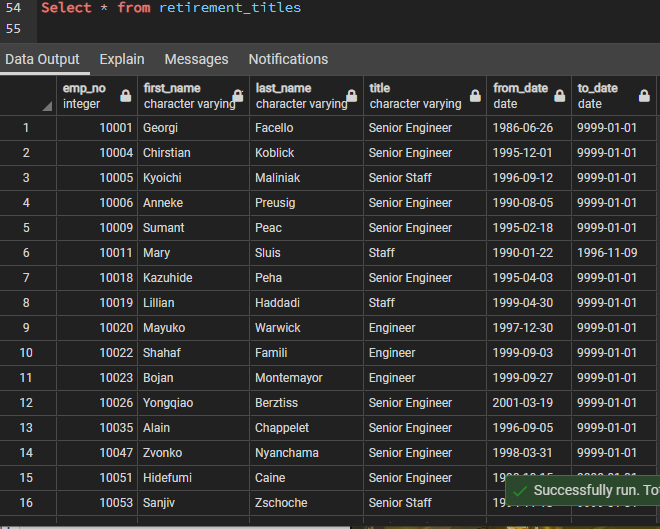
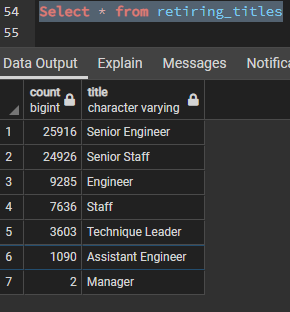
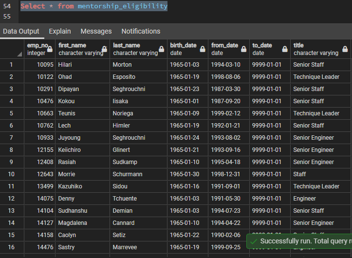

# Pewlett-Hackard-Analysis

## Project Overview
Preparing Pewlett-Hackard for the upcoming for the Silver-Tsunami (mass retirement)
### Analysis of retiring employees and those whom are eligible for a Mentorship Program

## Resources
- Data Source: employees.csv, retirement_info.csv, titles.csv, dept_emp.csv, dept_manager.csv, departments.csv, mentorship_eligibility.csv, retiring_titles.csv
- Software: PostgresSQL, pgAdmin, QuickDatabase Diagrams

## Results: 
- Pewlett-Hackard needs to prepare for 72,458 employees to retire in the near future.

- Senior Engineer (losing 25,916), and Senior Staff (losing 24,926) combined lose 50,842 people which is 70% of the retiring total.

- There are an eligible 1,500 employees for the mentorship program to fill the retiring spot.

- Immediate interviewing/training must occur in order for Pewlett-Hackard to maintain operational standards.

## Summary: 
As the wave or retirement begins there will be approx. 70,000 positions open for hiring and training. Recommendation for HR to work with department heads to prepare materials for interviewing/hiring ideal candidates base on their skill-set.
Plenty of staff on hand now for immediate uptraining to train the new hires and fill positions as retirements hit.
Employees could be encouraged to look at the open positions and fill in teams across the company, as long as certain criteria are met.

